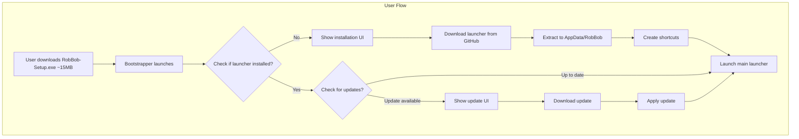
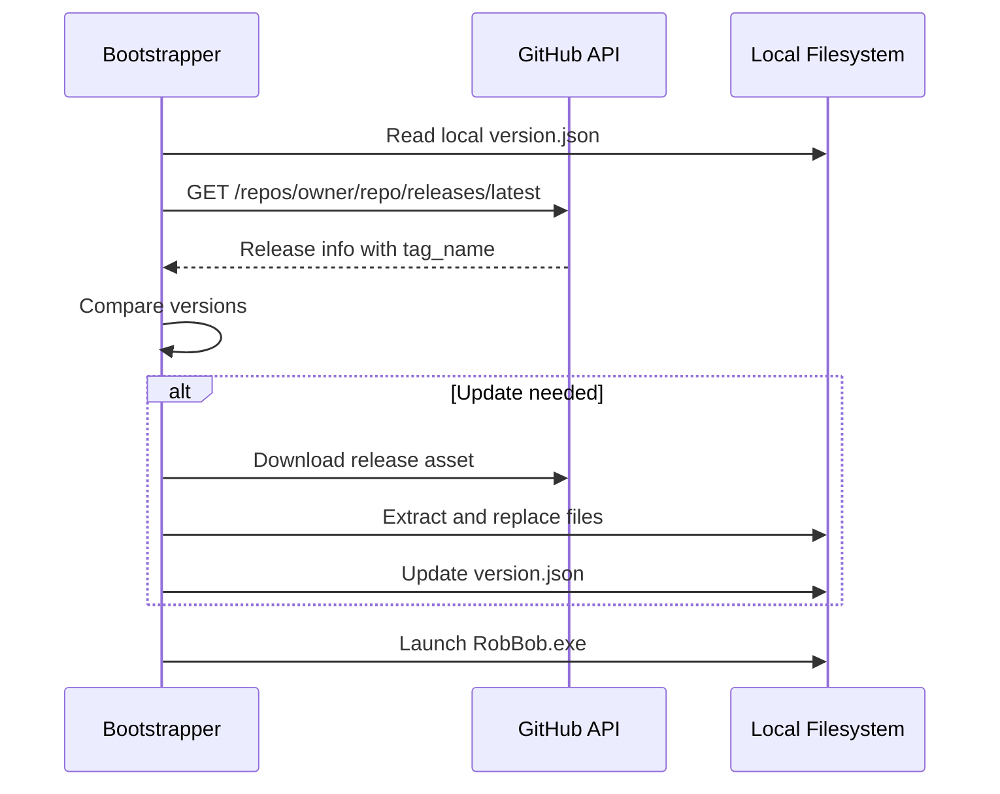
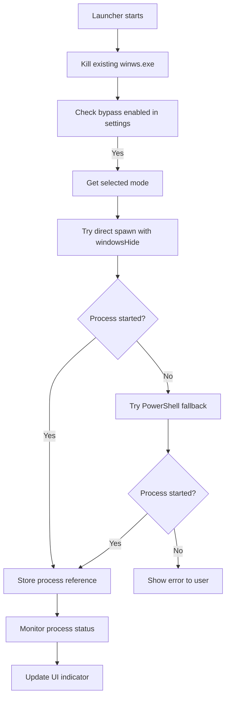
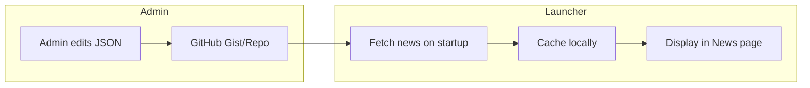

# RobBob Launcher Enhancement Plan

## Overview

This plan covers three major enhancements to the RobBob Launcher:

1. **Electron Bootstrapper** - Replace NSIS installer with a beautiful Electron-based installer
2. **Zapret Silent Integration** - Run bypass without showing second window
3. **Dynamic News System** - Admin panel to manage launcher news via GitHub

---

## 1. Electron Bootstrapper

### 1.1 Architecture



### 1.2 Project Structure

```
bootstrapper/
├── electron-bootstrapper/
│   ├── package.json
│   ├── main.js              # Electron main process
│   ├── preload.js           # Preload script
│   └── src/
│       ├── index.html       # Installer UI
│       ├── styles/
│       │   └── main.css     # Same glass-morphism style
│       └── scripts/
│           ├── installer.js  # Installation logic
│           └── updater.js    # Update checking
```

### 1.3 Key Features

| Feature | Description |
|---------|-------------|
| Beautiful UI | Same glass-morphism design as main launcher |
| Progress tracking | Real-time download/extraction progress |
| Version checking | Compare local vs GitHub release versions |
| Auto-update | Check and apply updates before launching |
| Error handling | Retry downloads, show friendly errors |
| Shortcuts | Create desktop and Start menu shortcuts |

### 1.4 Bootstrapper UI Design

The bootstrapper will have a minimalist design matching the launcher:

- Dark background with gradient
- ROBBOB logo with glow effect
- Animated progress bar
- Status text showing current operation
- Single window, no console

### 1.5 Version Management



### 1.6 Configuration

```javascript
// bootstrapper/electron-bootstrapper/config.js
module.exports = {
  GITHUB_OWNER: 'yamineki',
  GITHUB_REPO: 'roboby-releases',
  INSTALL_DIR: process.env.LOCALAPPDATA + '/RobBob',
  LAUNCHER_EXE: 'RobBob.exe',
  RELEASE_ASSET: 'RobBob-Full.zip',
  VERSION_FILE: 'version.json'
};
```

---

## 2. Zapret Silent Execution

### 2.1 Current Problem

The current implementation in [`main.js`](../main.js:388) uses a VBS script workaround which can be unreliable. The winws.exe process sometimes shows a console window.

### 2.2 Solution

Improve the spawn configuration and add PowerShell hidden execution as fallback:

```javascript
// Improved startBypass function
function startBypassSilent(mode) {
  const bypassPath = getBypassPath();
  const winwsPath = path.join(bypassPath, 'bin', 'winws.exe');
  
  // Kill existing processes first
  execSync('taskkill /F /IM winws.exe 2>nul', { 
    windowsHide: true, 
    stdio: 'ignore' 
  });
  
  const args = getArgsForMode(mode);
  
  // Method 1: Direct spawn with windowsHide
  winwsProcess = spawn(winwsPath, args, {
    cwd: path.join(bypassPath, 'bin'),
    windowsHide: true,     // Hide console window
    detached: true,        // Run independently
    stdio: 'ignore',       // No stdout/stderr
    shell: false           // Direct execution
  });
  
  winwsProcess.unref(); // Allow launcher to exit independently
}
```

### 2.3 Fallback Method

If direct spawn fails, use PowerShell hidden execution:

```javascript
function startBypassPowerShell(mode) {
  const batPath = path.join(getBypassPath(), getBatFileName(mode));
  
  spawn('powershell.exe', [
    '-WindowStyle', 'Hidden',
    '-Command', `Start-Process -FilePath '${batPath}' -WindowStyle Hidden`
  ], {
    windowsHide: true,
    detached: true,
    stdio: 'ignore'
  });
}
```

### 2.4 Process Management Flow



---

## 3. Dynamic News System

### 3.1 Architecture



### 3.2 News Data Structure

The news will be stored in a GitHub Gist or repository JSON file:

```json
{
  "version": 1,
  "lastUpdated": "2024-01-15T10:00:00Z",
  "news": [
    {
      "id": "news-001",
      "title": "Update v1.1 Released",
      "emoji": "rocket",
      "content": "New features and improvements!",
      "date": "2024-01-15",
      "pinned": true,
      "link": null
    },
    {
      "id": "news-002", 
      "title": "Network Mode Improvements",
      "emoji": "shield",
      "content": "Better stability for bypass connections.",
      "date": "2024-01-10",
      "pinned": false,
      "link": "https://github.com/..."
    }
  ]
}
```

### 3.3 News Fetching Service

```javascript
// src/scripts/news.js
const NewsService = {
  GIST_URL: 'https://gist.githubusercontent.com/USER/GIST_ID/raw/news.json',
  CACHE_KEY: 'cachedNews',
  CACHE_DURATION: 5 * 60 * 1000, // 5 minutes
  
  async fetchNews() {
    try {
      const response = await fetch(this.GIST_URL + '?t=' + Date.now());
      const data = await response.json();
      this.cacheNews(data);
      return data.news;
    } catch (err) {
      return this.getCachedNews();
    }
  },
  
  cacheNews(data) {
    localStorage.setItem(this.CACHE_KEY, JSON.stringify({
      timestamp: Date.now(),
      data: data
    }));
  },
  
  getCachedNews() {
    const cached = localStorage.getItem(this.CACHE_KEY);
    if (cached) {
      return JSON.parse(cached).data.news;
    }
    return [];
  }
};
```

### 3.4 News Page UI Update

Update the news page in [`src/index.html`](../src/index.html:120) to be dynamic:

```html
<!-- News Page -->
<div id="page-news" class="page">
  <div class="page-inner">
    <h2>Новости</h2>
    <div id="newsContainer" class="news-container">
      <!-- News cards will be inserted here dynamically -->
      <div class="news-loading">Загрузка новостей...</div>
    </div>
  </div>
</div>
```

### 3.5 Admin Panel Options

Since you chose GitHub Gist/JSON storage, here are admin panel options:

#### Option A: Direct Gist Editing
- Edit the JSON file directly in GitHub Gist
- Simple, no additional tools needed
- Requires knowing JSON syntax

#### Option B: Simple Web Editor
Create a simple HTML page that helps format news:

```
admin/
├── index.html      # Simple news editor
├── editor.js       # Form to JSON converter
└── README.md       # Instructions
```

The editor would:
1. Provide form inputs for news fields
2. Generate properly formatted JSON
3. User copies JSON to GitHub Gist

#### Option C: GitHub Pages Admin Panel
A more sophisticated option using GitHub Pages:
- Static HTML/JS admin panel
- GitHub API integration with personal access token
- Direct Gist updates from the panel

### 3.6 Recommended: Simple Web Editor

```html
<!-- admin/index.html -->
<!DOCTYPE html>
<html>
<head>
  <title>RobBob News Editor</title>
  <style>
    /* Dark theme matching launcher */
    body { background: #0a0b0f; color: #f8fafc; font-family: system-ui; }
    .container { max-width: 600px; margin: 0 auto; padding: 20px; }
    input, textarea { width: 100%; padding: 10px; margin: 5px 0; 
                      background: #12131a; border: 1px solid #333; 
                      color: #fff; border-radius: 8px; }
    button { background: #a855f7; color: #fff; padding: 12px 24px;
             border: none; border-radius: 8px; cursor: pointer; }
    #output { background: #12131a; padding: 15px; border-radius: 8px;
              white-space: pre-wrap; font-family: monospace; }
  </style>
</head>
<body>
  <div class="container">
    <h1>RobBob News Editor</h1>
    <form id="newsForm">
      <input type="text" id="title" placeholder="Заголовок" required>
      <select id="emoji">
        <option value="rocket">🚀 Обновление</option>
        <option value="shield">🛡️ Безопасность</option>
        <option value="zap">⚡ Улучшение</option>
        <option value="star">⭐ Новинка</option>
      </select>
      <textarea id="content" placeholder="Содержание" rows="3" required></textarea>
      <input type="text" id="link" placeholder="Ссылка (опционально)">
      <label><input type="checkbox" id="pinned"> Закрепить</label>
      <button type="submit">Сгенерировать JSON</button>
    </form>
    <h3>Результат:</h3>
    <div id="output"></div>
    <button onclick="copyOutput()">Копировать</button>
  </div>
  <script src="editor.js"></script>
</body>
</html>
```

---

## 4. Implementation Plan

### Phase 1: Zapret Silent Execution
1. Refactor [`startBypass()`](../main.js:388) function
2. Add PowerShell fallback method
3. Test on different Windows versions
4. Update status indicators

### Phase 2: Dynamic News System
1. Create GitHub Gist for news storage
2. Add NewsService to launcher
3. Update news page to load dynamically
4. Create simple admin editor HTML
5. Test caching and offline support

### Phase 3: Electron Bootstrapper
1. Create new Electron project in bootstrapper/electron-bootstrapper/
2. Design installer UI matching launcher style
3. Implement download/extraction logic
4. Add version comparison and auto-update
5. Build and test installer package
6. Update documentation

---

## 5. File Changes Summary

### New Files

| File | Purpose |
|------|---------|
| `bootstrapper/electron-bootstrapper/*` | New Electron bootstrapper app |
| `src/scripts/news.js` | News fetching service |
| `admin/index.html` | Simple news editor |
| `admin/editor.js` | News form to JSON converter |

### Modified Files

| File | Changes |
|------|---------|
| `main.js` | Improve zapret silent execution |
| `src/index.html` | Dynamic news container |
| `src/styles/main.css` | News card styles |
| `preload.js` | Add news API if needed |

---

## 6. Testing Checklist

### Bootstrapper
- [ ] Downloads launcher from GitHub
- [ ] Shows progress correctly
- [ ] Creates shortcuts
- [ ] Handles network errors gracefully
- [ ] Updates existing installation
- [ ] No console windows visible

### Zapret
- [ ] Starts without visible window
- [ ] Works on Windows 10
- [ ] Works on Windows 11
- [ ] Process terminates on launcher exit
- [ ] Status indicator updates correctly

### News System
- [ ] Fetches news from Gist
- [ ] Caches news locally
- [ ] Works offline with cache
- [ ] Displays news correctly
- [ ] Admin editor generates valid JSON

---

## 7. Questions for Review

1. Do you want the bootstrapper to auto-start the launcher after installation, or show a "Launch Now" button?

2. For the admin panel, do you want just the simple HTML editor, or should I also create a GitHub Pages version with direct Gist API integration?

3. Should the news system show notifications for new news items, or just update the news page silently?
