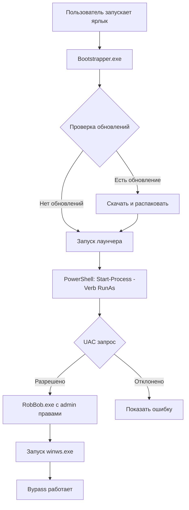

# План исправлений RobBob Launcher

## Обзор задач

Этот план описывает 8 исправлений для лаунчера RobBob, которые улучшат пользовательский опыт и функциональность.

---

## Исправление 1: Tutorial система - blur эффект и направление стрелок

### Проблема
1. Во время tutorial всё размыто, включая выделенный элемент. Нужно сделать ВСЁ размытым, КРОМЕ целевого элемента
2. Стрелки указывают неправильное направление (например, плашка справа, кнопка слева, а стрелка указывает вниз)

### Решение

#### Файл: `src/styles/main.css`

Текущая реализация использует `box-shadow: 0 0 0 9999px` для создания затемнения вокруг spotlight. Нужно изменить подход:

```css
/* Изменить .tutorial-backdrop - добавить blur на всё */
.tutorial-backdrop {
  position: absolute;
  inset: 0;
  background: rgba(0, 0, 0, 0.7);
  backdrop-filter: blur(8px);
  -webkit-backdrop-filter: blur(8px);
}

/* Spotlight должен вырезать дырку в backdrop через clip-path */
.tutorial-spotlight {
  position: absolute;
  border-radius: var(--radius);
  background: transparent;
  box-shadow: 
    0 0 0 4px var(--green),
    0 0 20px var(--green-glow);
  pointer-events: none;
  transition: all 0.4s cubic-bezier(0.4, 0, 0.2, 1);
  z-index: 15002;
}
```

Альтернативный подход - использовать SVG mask для вырезания области spotlight из размытого фона.

#### Файл: `src/scripts/tutorial.js`

Исправить логику направления стрелок:

```javascript
// Текущая проблема в updatePositions():
// - arrow: 'left' должен указывать СЛЕВА направо (на элемент справа)
// - Нужно пересмотреть логику позиционирования

// Для каждого шага определить правильное направление:
steps: [
  {
    target: '#openLogin',
    text: 'Войти в профиль Roblox',
    arrow: 'bottom-left'  // Плашка снизу-слева от кнопки, стрелка указывает вверх-вправо
  },
  {
    target: '#playBtn',
    text: 'Это поможет вам зайти в роблокс!',
    arrow: 'bottom'  // Плашка снизу, стрелка вверх
  },
  {
    target: '[data-page="page-settings"]',
    text: 'Поменяйте метод соединения',
    arrow: 'right'  // Плашка справа от sidebar, стрелка указывает влево
  },
  {
    target: '[data-page="page-news"]',
    text: 'Различные новости о лаунчере!',
    arrow: 'right'  // Плашка справа от sidebar, стрелка указывает влево
  }
]
```

Переписать функцию `updatePositions()` с корректной логикой:
- Стрелка должна указывать ОТ tooltip К target
- SVG path должен быть динамическим в зависимости от направления

### Изменяемые файлы
- `src/styles/main.css` - секция Tutorial System (строки 1933-2095)
- `src/scripts/tutorial.js` - функция `updatePositions()` (строки 186-256)

---

## Исправление 2: Изменить bypass по умолчанию с ALT7 на general

### Проблема
При первом запуске выбран режим ALT7 вместо основного (general) метода обхода.

### Решение

#### Файл: `main.js`

Изменить значение по умолчанию в нескольких местах:

```javascript
// Строка 362: startBypass()
const selectedMode = mode || store.get('bypassMode', 'general'); // было 'ALT7'

// Строка 555: get-settings handler
bypassMode: store.get('bypassMode', 'general'), // было 'ALT7'

// Строка 732: get-network-status handler  
mode: store.get('bypassMode', 'general') // было 'ALT7'

// Строка 745: get-bypass-status handler
mode: store.get('bypassMode', 'general') // было 'ALT7'

// Строка 814: detect-provider handler fallback
mode: 'general', // было 'ALT7'
```

### Изменяемые файлы
- `main.js` - 5 мест с 'ALT7' заменить на 'general'

---

## Исправление 3: Tutorial показывается только один раз

### Проблема
Tutorial показывается при каждом входе, хотя должен показываться только при первом запуске.

### Анализ
В `tutorial.js` уже есть проверка `settings.tutorialCompleted`, но проблема может быть в:
1. `start()` вызывается без проверки
2. Настройка не сохраняется корректно

### Решение

#### Файл: `src/scripts/tutorial.js`

```javascript
// Добавить проверку в start() метод
async start() {
  // Проверяем, не завершен ли уже tutorial
  if (window.electronAPI) {
    const settings = await window.electronAPI.getSettings();
    if (settings.tutorialCompleted) {
      console.log('Tutorial already completed, skipping');
      return;
    }
  }
  
  // ... остальной код
}
```

#### Файл: `src/scripts/loading.js`

Проверить, что tutorial запускается ТОЛЬКО если tutorialCompleted = false:

```javascript
// При завершении загрузки
async function finishLoading() {
  // ... скрыть экран загрузки
  
  // Запускать tutorial ТОЛЬКО если не был завершен
  if (window.electronAPI) {
    const settings = await window.electronAPI.getSettings();
    if (!settings.tutorialCompleted) {
      Tutorial.start();
    }
  }
}
```

### Изменяемые файлы
- `src/scripts/tutorial.js` - метод `start()` (строки 125-142)
- `src/scripts/loading.js` - проверка перед запуском tutorial

---

## Исправление 4: Сделать подложку настроек темнее

### Проблема
Фон карточки настроек слишком светлый, текст плохо читается.

### Решение

#### Файл: `src/styles/main.css`

Создать отдельный класс для карточки настроек:

```css
/* Добавить в секцию Cards или Settings */
#page-settings .card {
  background: rgba(5, 5, 12, 0.55);  /* Темнее чем var(--panel): rgba(10,10,20,0.35) */
  backdrop-filter: blur(20px) saturate(180%);
  -webkit-backdrop-filter: blur(20px) saturate(180%);
}

/* Для светлой темы */
[data-theme='light'] #page-settings .card {
  background: rgba(255, 255, 255, 0.45);
}
```

### Изменяемые файлы
- `src/styles/main.css` - добавить стили для #page-settings .card

---

## Исправление 5: Добавить выбор пути установки в bootstrapper

### Проблема
Нет возможности выбрать куда установить лаунчер.

### Решение

#### Файл: `bootstrapper/electron-bootstrapper/main.js`

Добавить диалог выбора папки:

```javascript
const { app, BrowserWindow, ipcMain, dialog } = require('electron');

// Хранение выбранного пути
let customInstallPath = null;

// IPC handler для выбора папки
ipcMain.handle('select-install-path', async () => {
  const result = await dialog.showOpenDialog(mainWindow, {
    title: 'Выберите папку для установки',
    defaultPath: getAppDataPath(),
    properties: ['openDirectory', 'createDirectory']
  });
  
  if (!result.canceled && result.filePaths.length > 0) {
    customInstallPath = result.filePaths[0];
    return customInstallPath;
  }
  return null;
});

// Модифицировать getAppDataPath()
function getAppDataPath() {
  if (customInstallPath) {
    return path.join(customInstallPath, CONFIG.appFolder);
  }
  return path.join(app.getPath('userData'), '..', CONFIG.appFolder);
}
```

#### Файл: `bootstrapper/electron-bootstrapper/src/index.html`

Добавить UI для выбора пути:

```html
<div class="install-path-section">
  <div class="path-label">Путь установки:</div>
  <div class="path-value" id="installPath">%APPDATA%/RobBob</div>
  <button class="path-btn" id="selectPath">Изменить</button>
</div>
```

#### Файл: `bootstrapper/electron-bootstrapper/preload.js`

Добавить API:

```javascript
contextBridge.exposeInMainWorld('electronAPI', {
  // ... существующие методы
  selectInstallPath: () => ipcRenderer.invoke('select-install-path')
});
```

### Изменяемые файлы
- `bootstrapper/electron-bootstrapper/main.js` - диалог выбора
- `bootstrapper/electron-bootstrapper/src/index.html` - UI элементы
- `bootstrapper/electron-bootstrapper/preload.js` - IPC API

---

## Исправление 6: Ярлык на bootstrapper вместо RobBob.exe

### Проблема
Ярлык создается на RobBob.exe, но должен создаваться на bootstrapper для автоматической проверки обновлений.

### Решение

#### Файл: `bootstrapper/electron-bootstrapper/main.js`

Изменить функцию `createDesktopShortcut()`:

```javascript
// Создать ярлык на сам bootstrapper
function createDesktopShortcut() {
  return new Promise((resolve, reject) => {
    const desktopPath = path.join(require('os').homedir(), 'Desktop');
    const shortcutPath = path.join(desktopPath, 'RobBob Launcher.lnk');
    
    // Путь к bootstrapper (текущему exe)
    const bootstrapperPath = app.getPath('exe');
    
    const psCommand = `
      $WshShell = New-Object -comObject WScript.Shell;
      $Shortcut = $WshShell.CreateShortcut('${shortcutPath}');
      $Shortcut.TargetPath = '${bootstrapperPath}';
      $Shortcut.WorkingDirectory = '${path.dirname(bootstrapperPath)}';
      $Shortcut.Description = 'RobBob Launcher - Всегда актуальная версия';
      $Shortcut.Save()
    `.replace(/\n/g, ' ');
    
    exec(`powershell -Command "${psCommand}"`, { windowsHide: true }, (err) => {
      if (err) {
        console.error('Failed to create shortcut:', err);
      }
      resolve();
    });
  });
}
```

### Изменяемые файлы
- `bootstrapper/electron-bootstrapper/main.js` - функция `createDesktopShortcut()` (строки 179-205)

---

## Исправление 7: КРИТИЧНО - Запуск с правами администратора

### Проблема
Bypass не работает без прав администратора, что критично для функционала лаунчера.

### Решение (многоуровневое)

#### Уровень 1: Manifest для bootstrapper

Создать файл `bootstrapper/electron-bootstrapper/build/installer.nsh`:

```nsh
!macro customInstall
  ; Request admin rights
  RequestExecutionLevel admin
!macroend
```

#### Уровень 2: Bootstrapper запускает launcher с elevation

#### Файл: `bootstrapper/electron-bootstrapper/main.js`

```javascript
// Модифицировать runApp()
function runApp() {
  const exePath = getAppExecutablePath();
  
  if (!fs.existsSync(exePath)) {
    sendStatus('error', 'Приложение не найдено');
    return;
  }
  
  sendStatus('status', 'Запуск с правами администратора...');
  
  // Запуск с elevation через PowerShell
  const child = spawn('powershell.exe', [
    '-Command',
    `Start-Process -FilePath "${exePath}" -Verb RunAs`
  ], {
    detached: true,
    stdio: 'ignore',
    windowsHide: true
  });
  
  child.unref();
  
  setTimeout(() => {
    app.quit();
  }, 500);
}
```

#### Уровень 3: package.json для electron-builder

#### Файл: `bootstrapper/electron-bootstrapper/package.json`

```json
{
  "build": {
    "win": {
      "requestedExecutionLevel": "requireAdministrator"
    }
  }
}
```

#### Уровень 4: Убрать повторный запрос в main.js лаунчера

После того как bootstrapper запускает с admin правами, main.js уже не нужно проверять/перезапускать.

Можно добавить аргумент `--elevated` и проверять его:

```javascript
// main.js - в начале файла
const isElevated = process.argv.includes('--elevated');

// Модифицировать проверку прав
if (process.platform === 'win32' && !isElevated && !process.argv.includes('--no-admin-check')) {
  // ... существующая логика перезапуска
}
```

### Изменяемые файлы
- `bootstrapper/electron-bootstrapper/main.js` - функция `runApp()`
- `bootstrapper/electron-bootstrapper/package.json` - build config
- `main.js` - опционально убрать дублирующую проверку

---

## Исправление 8: API для новостей через админ-панель сайта

### Проблема
Новости берутся из GitHub Gist, нужно переключить на API сайта с возможностью управления через админ-панель.

### Решение

#### Файл: `src/scripts/news.js`

```javascript
const NewsService = {
  // Новый URL API
  API_URL: 'https://robbob.ru/api/news',
  
  // ... остальные свойства без изменений
  
  async fetchNews() {
    try {
      const url = this.API_URL + '?t=' + Date.now();
      const response = await fetch(url);
      
      if (!response.ok) {
        throw new Error('Failed to fetch news');
      }
      
      const data = await response.json();
      this.cacheNews(data);
      return data.news || [];
    } catch (err) {
      console.error('Error fetching news:', err);
      return this.getCachedNews();
    }
  }
  
  // ... остальные методы без изменений
};
```

### Для сайта (отдельный репозиторий /site)

Нужно создать:

1. **API endpoint** `GET /api/news`:
```javascript
// routes/api/news.js
router.get('/news', async (req, res) => {
  const news = await News.find().sort({ date: -1 }).limit(20);
  res.json({ news });
});
```

2. **Admin panel** для управления новостями:
- Добавление новости
- Редактирование
- Удаление
- Закрепление (pinned)

3. **Модель новости**:
```javascript
const NewsSchema = new Schema({
  id: String,
  title: String,
  emoji: String,  // rocket, shield, zap, etc.
  content: String,
  date: Date,
  pinned: Boolean,
  link: String
});
```

### Изменяемые файлы
- `src/scripts/news.js` - изменить GIST_URL на API_URL
- Сайт (другой репо): создать API endpoint и админ-панель

---

## Диаграмма потока запуска с admin правами



---

## Порядок реализации

1. **Исправление 2** - Простое, быстрое (5 строк)
2. **Исправление 4** - Простое, CSS (10 строк)
3. **Исправление 3** - Простое, JS (добавить проверку)
4. **Исправление 1** - Среднее, CSS + JS (переработка tutorial)
5. **Исправление 7** - КРИТИЧНО, требует тестирования
6. **Исправление 6** - Простое (изменить путь в функции)
7. **Исправление 5** - Среднее (добавить UI и логику)
8. **Исправление 8** - Зависит от сайта (отдельная работа)

---

## Примечания

- Все изменения должны быть протестированы на Windows
- Исправление 7 (admin права) критично - без него обход не работает
- Исправление 8 требует работы в отдельном репозитории сайта
- После всех изменений нужно пересобрать bootstrapper и лаунчер
